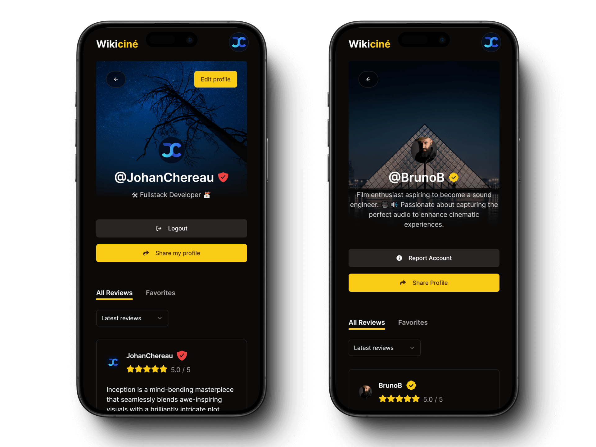

<h1 style="display: flex; flex-wrap: wrap;">
 <span>Wikiciné</span>
 ikiciné logo, representing a W and a C" width="60" style="margin-left: 16px;"/>
</h1>

<div style="display: flex; flex-wrap: wrap;">
  
  
  
  
  
</div>

## Table of Contents

1. [Introduction](#introduction)
2. [Live Demos](#live-demos)
3. [Project Description](#project-description)
   - [What](#what)
   - [Who](#who)
   - [Why](#why)
   - [How](#how)
4. [Features](#features)
5. [Mockups and Design](#mockups-and-design)
6. [Results](#results)
7. [Future Improvements](#future-improvements)
8. [Technologies Used](#technologies-used)
9. [Credits and Acknowledgments](#credits-and-acknowledgments)
10. [License](#license)

---

## Introduction

🎬 **Wikiciné** is an innovative project developed by three dynamic developers as part of our training at [Dawan](https://www.dawan.fr/), a renowned training center with over 24 years of experience and more than 2000 courses. Dawan is committed to fostering a love for learning, understanding, and sharing, ensuring the best environment, content, and trainers for its students.

### Background and Origin

🌟 Wikiciné was born out of our desire to enhance our skills through a concrete team project. We identified the need for a centralized and interactive platform dedicated to movie enthusiasts, where users can access comprehensive movie information, reviews, and discussions.

### Objectives

🎯 Our project has several key objectives:

- **Skill Development**: To improve our competencies in coding, project management, UI/UX design, accessibility, GDPR compliance, and both front-end and back-end development.

- **Centralized Information**: To provide a single platform offering detailed information about movies, including synopses, cast and crew details, and user reviews.

- **User Engagement**: To create an interactive environment where users can contribute their own reviews, ratings, and discussions.

- **Professional Workflow**: To follow an agile Scrum workflow, utilizing GitHub for project management and ticketing, simulating a real-world professional environment.

🎥 Wikiciné is more than just a movie database; it is a community-driven project that aims to enrich the movie-watching experience by providing detailed insights and fostering a vibrant community of film enthusiasts.

## Live Demos

🚀 **Experience Wikiciné Live!**

We are excited to share a live demonstration of Wikiciné, which will be deployed using Netlify. You will soon be able to explore our platform and see all its features in action.

### Access the Live Demo

Click the link below to access the live demo of Wikiciné:
[Wikiciné Live Demo](#) _(Link will be available soon)_

Stay tuned for updates!

## Project Description

### What

🎬 **Wikiciné** is a web application designed to be a comprehensive platform for movie enthusiasts. It provides a space where users can access detailed information about nearly a million movies from around the world, as well as insights into the stars of the cinema, including actors, producers, directors, and other film industry professionals.

### Who

👥 **Target Audience**: Wikiciné is aimed at a diverse community that includes movie amateurs, passionate cinephiles, and industry professionals. This platform is built to cater to anyone with an interest in the world of cinema.

### Why

❓ **Reason for Creation**: The motivation behind creating Wikiciné stems from the observation that there are very few applications that facilitate sharing and discussions about the behind-the-scenes aspects of the movie industry. We wanted to create a platform that brings together the audience and the stars, fostering a space for exchange and engagement.

### How

🔧 **Functionality**: Wikiciné allows movie lovers to debate and share their opinions through a comment section. It serves as a repository of extensive information on movies and film personalities, enabling users to explore and learn about different facets of the movie industry. Moreover, film professionals can share their experiences, anecdotes, and challenges faced during their careers, enriching the community with authentic industry insights. The platform is designed to create a strong connection between movie stars and their fans, allowing for direct interaction and community building, thus bridging the gap between the public and their favorite cinema icons.

## Features

- [x] **Search Movies**: Textually search for movies and access search results.

- [ ] **Filter Movies**: Apply various filters to narrow down movie search results.

- [x] **View Movie Details**: Access detailed information about movies including synopses, cast, and crew.

- [x] **View Comments**: Read comments on movie detail pages to see others' opinions.

- [x] **View Critiques**: Browse critiques on the movie detail pages.

- [x] **User Registration**: Sign up to create an account.

- [x] **View Member Profiles**: Access profiles of other members.

- [x] **Post Comments**: Write and share comments about movies.

- [ ] **Reply to Comments**: Engage with other users by replying to their comments.

- [x] **User Login**: Log in to have a personalized user experience.

- [x] **User Logout**: Log out to end the current session.

- [ ] **🚧 Favorites List**: Add, remove, and access a list of favorite movies.

- [ ] **🚧 Edit Profile**: Modify profile information including profile picture and username.

- [x] **View Own Profile**: Access your own personalized profile page.

- [x] **Comment on Critiques**: Engage with critiques by posting comments.

- [x] **Create Movie/Series Page**: Add new movies or series with detailed information.

- [x] **Post Critiques**: Write and post expert critiques about movies.

- [x] **Edit Movie Pages**: Add or remove information from movie pages.

- [ ] **Delete Comments**: Moderators can delete comments to regulate the space.

- [ ] **Ban User Accounts**: Moderators can ban user accounts for violations.

- [ ] **Modify Member Roles**: Moderators can change member roles and privileges.

- [x] **Theme Toggle (Dark/Light)**: Switch between dark and light themes for a personalized viewing experience.

## Mockups and Design

🎨 **Crafted with Precision: Modern, Mobile-First Design**

Our journey through Wikiciné's design began with a commitment to excellence in user experience. Embracing a mobile-first approach, we envisioned a seamless transition from smartphones to larger screens like tablets and PCs, ensuring every interaction feels intuitive and engaging.

### Figma: Where Creativity Meets Functionality

In Figma, we meticulously crafted each screen to embody modern aesthetics while prioritizing usability. From the sleek registration and login pages to the vibrant homepage, every element was meticulously placed to enhance user interaction and visual appeal.

### Screenshots Showcase

1. **Registration and Login**: Seamlessly integrated, designed for effortless onboarding.

   

2. **Homepage**: Captivating users with a dynamic display of featured content and easy navigation.

   

3. **Search Results**: Empowering users with comprehensive filtering options for precise movie discovery.

   

4. **Movie Details and Wiki**: Delving deep into films with user and expert critiques, alongside a richly detailed Wiki page in markdown format.

   

5. **User Profiles**: Discovering other users' profiles effortlessly and managing our own customizable profile, designed for personalization and interaction.

   

### Vision to Reality

Each screenshot reflects our dedication to creating a visually appealing and functionally robust platform. Our design choices aim not only to impress but also to elevate the user experience, ensuring Wikiciné becomes the go-to destination for movie enthusiasts worldwide.

---

### Take a Sneak Peek

Explore our design journey through these snapshots, where innovation meets elegance, and functionality meets flair. Wikiciné awaits your exploration!

## Results

Throughout the development process, we aimed to faithfully reproduce our Figma mockups. However, through testing and user feedback, we iteratively refined our designs to ensure better coherence and enhanced user experience.

### Mobile Version

#### Sign Up and Sign In Pages

Pages designed for seamless user registration and authentication.


#### Home Page

Dynamic and engaging home screen designed to highlight featured content.


#### Results Page (Textual Search)

Comprehensive search results page offering textual search filtering options.


#### Movie Details Pages

Detailed information about movies, including user-generated reviews, professional critiques, and cast details.


#### WikiPages

Accessing curated information in a readable format and editing wiki content using Markdown for precise formatting.


#### User Profile

Viewing detailed profiles of other platform users.



### Desktop Version

#### SignUp Page

Efficient and user-friendly registration page tailored for desktop users.


#### SignIn Page

Streamlined login interface designed for secure access to user accounts.


#### Home Page

Feature-rich dashboard showcasing trending movies and latest updates.


#### Results Page

Comprehensive search results displayed in a clear and organized layout.


#### Movie Details Page

Detailed view of movie information, including reviews, critics' opinions, and cast details.


#### Wiki Page

Readable format for curated movie information and industry insights.


#### Wiki Edit Page

Editing interface for updating and maintaining wiki content using Markdown.


#### User Profile Page

Comprehensive profile view for personalized user interaction and settings management.


## Future Improvements

🔧 **Ongoing Development**: The project is still under active development, with several features yet to be fully implemented. Our goal is to take Wikiciné to new heights, extending its reach internationally and enhancing its functionality.

- **Administrative Tools and Favorites List**: Development is underway for comprehensive administrative tools and a robust favorites list feature. These will include options to manage user roles, moderate comments, and provide users with a personalized list of favorite movies.
- **User Experience Enhancements**: We aim to refine the user experience to make it truly unique. This includes adding clear indicators for actions that require an account, such as posting comments, to ensure users understand the platform's requirements and capabilities.

- **Profile Personalization**: We want to offer more options for users to personalize their profiles. This will allow each member to express their opinions and create a profile that truly represents their personality.

- **Complete Wiki System**: While the current wiki functionality is operational, we aim to build a more comprehensive system. This will enable multiple contributors to actively participate in creating and editing wiki pages using the integrated markdown editor.

- **Verification System**: By default, all users have the "user" role. We are exploring a reliable verification system for cinema stars (contributors) to obtain a contributor role without requiring admin intervention. This might involve a request system where admins can approve or deny role changes, ensuring genuine cinema star accounts without fake profiles or other issues.

## Technologies Used

<p align="center">
  <a href="https://skillicons.dev">
    
  </a>
</p>

### Front-End

| Icon                                                      | Technology                                                                | Description                                                                                                                 |
| --------------------------------------------------------- | ------------------------------------------------------------------------- | --------------------------------------------------------------------------------------------------------------------------- |
|             | [**React**](https://reactjs.org)                                          | A JavaScript library for building user interfaces. Used for creating interactive and dynamic components on the client-side. |
|           | [**JavaScript**](https://developer.mozilla.org/en-US/docs/Web/JavaScript) | The programming language of the web. Essential for adding interactive elements to web pages.                                |
|    | [**react-markdown**](https://github.com/remarkjs/react-markdown)          | A component for rendering Markdown in React applications. Used for displaying and editing wiki pages.                       |
|        | [**MDX Editor**](https://mdxjs.com)                                       | A tool for writing and editing content with Markdown and JSX. Used for creating rich, interactive content in wiki pages.    |
|  | [**react-router-dom**](https://reactrouter.com)                           | A collection of navigational components for React applications. Used for managing routing and navigation.                   |
|   | [**Tailwind CSS**](https://tailwindcss.com)                               | A utility-first CSS framework. Used for styling components with a focus on responsiveness and customizability.              |

### Back-End

| Icon                                                 | Technology                          | Description                                                                                         |
| ---------------------------------------------------- | ----------------------------------- | --------------------------------------------------------------------------------------------------- |
|  | [**Supabase**](https://supabase.io) | An open-source Firebase alternative. Used for authentication, database, and real-time capabilities. |

### Build Tools

| Icon                                         | Technology                     | Description                                                                                                                            |
| -------------------------------------------- | ------------------------------ | -------------------------------------------------------------------------------------------------------------------------------------- |
|  | [**Vite**](https://vitejs.dev) | A fast build tool and development server for modern web projects. Used for improving the development experience and build performance. |

### Design & Styling

| Icon                                           | Technology                     | Description                                                                            |
| ---------------------------------------------- | ------------------------------ | -------------------------------------------------------------------------------------- |
|  | [**Figma**](https://figma.com) | A web-based design tool. Used for creating mockups, wireframes, and design prototypes. |

### Organization

| Icon                                             | Technology                       | Description                                                                                                        |
| ------------------------------------------------ | -------------------------------- | ------------------------------------------------------------------------------------------------------------------ |
|        | [**Git**](https://git-scm.com)   | A distributed version control system. Used for tracking changes and collaborating on code.                         |
|  | [**GitHub**](https://github.com) | A code hosting platform for version control and collaboration. Used for managing repositories and project tickets. |

### Communication

| Icon                                               | Technology                         | Description                                                              |
| -------------------------------------------------- | ---------------------------------- | ------------------------------------------------------------------------ |
|  | [**Discord**](https://discord.com) | A communication platform. Used for team communication and collaboration. |

## Project Structure

The project is structured with a focus on separation of concerns to ensure maintainability, cleanliness, and organization. This approach helps in clearly delineating responsibilities and maintaining a structured codebase.

### Directory Structure

```bash
src/
├── assets/
├── components/
│   ├── layout/
│   ├── ui/
│   └── modals/
├── hooks/
├── pages/
├── services/
│   ├── api/
│   ├── providers/
│   └── supabase/
├── utils/
│   ├── icons/
│   ├── string/
│   └── style/
├── App.jsx
├── index.css
└── main.jsx
```

### Overview

- **`assets/`**: Contains project-wide assets such as images, fonts, etc.
- **`components/`**: Houses reusable UI components structured into `layout/`, `ui/` for presentational components, and `modals/` for modal components.

- **`hooks/`**: Custom React hooks used throughout the application for managing state and logic.

- **`pages/`**: Contains top-level React components representing different pages/routes of the application.

- **`services/`**: Includes modules for handling different aspects of the application's backend integration:

  - **`api/`**: Handles API communication.
  - **`providers/`**: Manages context providers for state management.
  - **`supabase/`**: Integrates with Supabase for authentication, database operations, and real-time capabilities.

- **`utils/`**: Utility functions and helper modules categorized into `icons/`, `string/`, and `style/` for managing icon sets, string manipulations, and styles respectively.

### Purpose

The project structure is designed with a primary focus on separation of concerns and maintainability. This approach aims to achieve the following:

- **Clarity**: Organizing components, hooks, and utilities into separate directories enhances code readability and ease of navigation.

- **Modularity**: Dividing functionality into discrete modules promotes reusability and facilitates easier testing and debugging.

- **Scalability**: By establishing a structured architecture, the project becomes more adaptable to future changes and additions, ensuring scalability as the application grows.

- **Collaboration**: Clear separation of responsibilities among different modules fosters efficient collaboration among team members, enabling them to work on different parts of the application independently.

- **Long-term Maintenance**: Maintaining a clean and well-organized codebase reduces technical debt and simplifies ongoing maintenance tasks, ensuring the project remains robust and sustainable over time.

## Credits and Acknowledgments

We extend our heartfelt gratitude to everyone who contributed to the development and success of this project. Special thanks to our dedicated developers for their hard work and expertise in bringing this platform to life. We are also thankful to Dawan for their continuous support and commitment to our education and growth. Lastly, we appreciate The Movie DB for providing their API, which has been integral to enriching our platform with extensive movie data. Together, your contributions have made this project possible.

### Developers

- [Icham Boudehane](https://github.com/Thomas92230)
- [Vincent Vignaud](https://github.com/VincentVignaud)
- [Johan Chereau](https://github.com/JohanChereau)

### School

[Dawan](https://www.dawan.fr/)

### Third-Party API

[The Movie DB Api](https://www.themoviedb.org/)

This product uses the TMDB API but is not endorsed or certified by TMDB.

### Logos

<div style="display: flex; gap: 20px; justify-content: center; flex-wrap: wrap;">
  
  
  
</div>

## License

> MIT License
>
> Copyright (c) 2024 Icham Boudehane, Vincent Vignaud, Johan Chereau
>
> Permission is hereby granted, free of charge, to any person obtaining a copy
> of this software and associated documentation files (the "Software"), to deal
> in the Software without restriction, including without limitation the rights
> to use, copy, modify, merge, publish, distribute, sublicense, and/or sell
> copies of the Software, and to permit persons to whom the Software is
> furnished to do so, subject to the following conditions:
>
> The above copyright notice and this permission notice shall be included in all
> copies or substantial portions of the Software.
>
> THE SOFTWARE IS PROVIDED "AS IS", WITHOUT WARRANTY OF ANY KIND, EXPRESS OR
> IMPLIED, INCLUDING BUT NOT LIMITED TO THE WARRANTIES OF MERCHANTABILITY,
> FITNESS FOR A PARTICULAR PURPOSE AND NONINFRINGEMENT. IN NO EVENT SHALL THE
> AUTHORS OR COPYRIGHT HOLDERS BE LIABLE FOR ANY CLAIM, DAMAGES OR OTHER
> LIABILITY, WHETHER IN AN ACTION OF CONTRACT, TORT OR OTHERWISE, ARISING FROM,
> OUT OF OR IN CONNECTION WITH THE SOFTWARE OR THE USE OR OTHER DEALINGS IN THE
> SOFTWARE.
